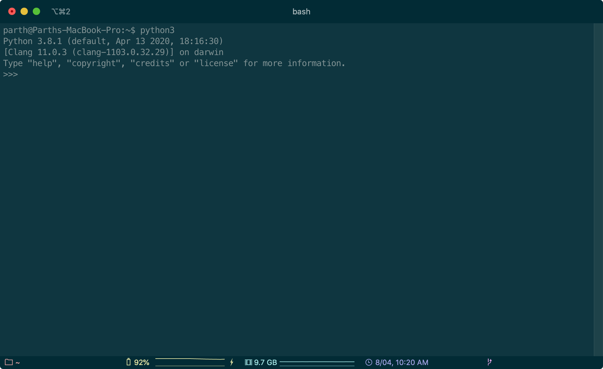
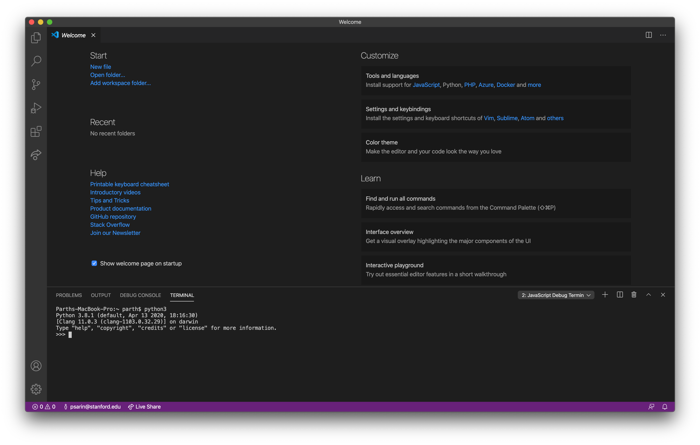
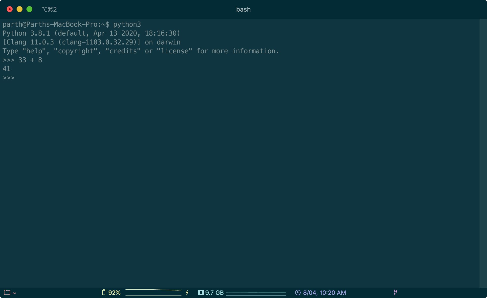

# Python Basics
Welcome to CS 41! In the first two weeks of CS 41, we're going to learn how to "translate" basic programming concepts into Python and learn a bit about Python's philosophy along the way. You should already know words like "variable", "string", and "function" so we won't explain what they are in these notes — instead, we'll focus on how those concepts are represented in Python. 

## Interactive Interpreter
The interactive interpreter is one way to execute Python code. Once you've installed Python, you can start the interactive interpreter in a few ways.

### Accessing the Interactive Interpreter
<ol>
<li> Open the Terminal and start the interactive interpreter in it. On Windows, you can access this by clicking Start, typing "cmd" into the search box, and clicking on "Command Prompt". On Mac, the Terminal application is in Applications > Utilities > Terminal. You should be greeted with a blinking cursor in front of a dollar sign. Type <code>py</code> if you're on Windows or <code>python3</code> if you're on Mac. The screen should look like:

<p align="center">
  <br />
  <i>The interactive interpreter in a terminal on my Mac computer.</i>
</p>
</li>
<li> We can also run the interactive interpreter through VS Code. Open VS Code and go to the menu. On Windows, click View > Terminal and on Mac click Terminal > New Terminal. A terminal should appear at the bottom of the screen. Type in <code>py</code> on Windows or <code>python3</code> on Mac.

<p align="center">
  <br />
  <i>The interactive interpreter in VS Code on my Mac computer.</i>
</p>
</li>
</ol>

In both of these methods, notice that just below the line where I typed <code>python3</code> starts with "Python 3.8.1 (default, ..." — it's important that you're running Python 3. If you see Python 2 on that line, you should revisit the install instructions to make sure that you have access to the latest version of Python.

For the rest of this course, we'll use screenshots from the terminal version of the intereactive interpreter, but the content should be the same as the VS Code version. 

### What is the Interactive Interpreter?
You can type any Python code into the interactive interpreter and it will execute in realtime. This is actually a big deal! If you wanted to execute code in C++, you'd have to write it, compile it, and then execute all of the commands at once. The interactive interpreter lets you execute small portions of Python code more quickly. This is especially beneficial when you're introducing a new feature to a large project and don't want to compile the entire project to test the new feature.

After the `>>>` sign, you can type any Python code, press enter, and it'll get executed. The interpreter will display the result of the code on the line below where you typed it in. For example,

<p align="center">
  <br />
  <i>You can add numbers in Python and in the interactive interpreter!</i>
</p>

## Variables and Types
In other languages like Java and C++, you need to tell the language a variable's type when it's declared.

```cpp
int x = 41;
```

The keyword `int` in the above line tells the compiler that `x` will hold an integer. It would be illegal to reassign `x = "Hello world"` because `x` can only hold an integer for its entire lifetime.

That's not true in Python. Variables are just references to objects and the type information is stored on the object. In practical terms, this means that a variable can be reassigned from one object to another even if those objects have different types. Consequently, you don't need to say what the type of a variable will be when its declared in Python.

```python
x = 41
x = "Unicorns rock!"
```

The `type` function will return information about the type of an object.

```python
type(41)              # => int
type("Unicorns rock") # => str
```

You'll rarely use `type` in production Python code, but it's useful in the interactive interpreter if you need to check what the type of some object is.

## Numbers and Booleans
### Numbers
There are three numeric types in Python: `int`, `float`, and `complex`. Let's talk about the first two. Integers are whole numbers without decimal places, just like in other languages. Floating point numbers can have decimal places.

Python supports many math operations. You'll probably use all of these at some point in your Python journey:

```python
5.  # => 5 (int)
5.0 # => 5.0 (float)

1 + 8   # => 9 (int)
8 + 5.1 # => 13.1 (float)
1 - 8   # => -7 (int)

2 * 4   # => 8 (int)
2 / 3   # => 0.666666 (float)
7 // 3  # => 2 (int; integer division)

7 % 3  # => 1 (int; modulo/remainder operator)
3 ** 3 # => 27 (int; exponential operator)
```

If you have a variable `x = 40` and want to add one to the value of that variable, there are two main ways to do that.

```python
x = x + 1
```

The line `x = x + 1` might seem strange. If you read this line like it's a mathematical equation, it seems like a contradiction. The Python interpreter, though, reads this differently: Python will execute the right hand side of this expression first (`x + 1` is `40 + 1` which is `41`) and then reassign `x` to be equal to that value. Altogether, this adds one to the value of `x`.

There's a shorter way to do this in Python:

```python
x += 1
```

In fact, you can combine any mathematical operator with the equals sign, and Python will update the variable accordingly.

```python
x += 5 # => x = x + 5
x -= 3 # => x = x – 3

x *= 2  # => x = x * 2
x /= 2  # => x = x / 2
x //= 4 # => x = x // 4

x %= 3  # => x = x % 3
x **= 3 # => x = x ** 3
```

### Booleans
A boolean object is either `True` or `False`. Python uses the words `True` and `False` to represent these concepts and, under the hood, they are secretly the numbers `1` and `0` respectively.

The `not` keyword will flip a boolean from `True` to `False` or vice versa. The `and` and `or` keywords can be placed between two boolean expressions and work like you'd expect from other languages. Here's an example of how these work:

```python
not True # => False

True and False # => False
True and True  # => True

True or False  # => True
False or False # => False
```

Finally, you can compare two objects in several ways.

* `a == b` if `a` is equal to `b`.
* `a != b` if `a` is not equal to `b`.
* `a > b` if `a` is strictly greater than `b`.
* `a >= b` if `a` is greater than or equal to `b`.

You can also chain multiple comparators together and they are combined using `and`. For example,

* `a > b > c` means `(a > b) and (b > c)`
* `a < b > c` means `(a < b) and (b > c)`
* `a == b > c != d` means `(a == b) and (b > c) and (c != d)`

Many of the above examples that involve chaining operators can be confusing to read, so you should try to avoid them when possible. For example, it's probably cleaner to write `(a < b) and (b > c)` instead of `a < b > c`. 

Here are some examples of comparing numbers in Python:

```python
5 == 5    # => True
1 != 100  # => True
3 > 6     # => False
4 >= 9    # => False
3 > 2 > 1 # => True (3 > 2 and 2 > 1)
```

## Strings and Lists
### Strings
#### Delimiters
In Python, a sequence of characters between a pair of double quotes (`"..."`) or single quotes (`'...'`) is a string. Unlike other languages, Python doesn't distinguish between strings of length one (`char`s in Java and C++) and longer strings.

Use a backslash to escape characters within a string. For example,

```python
'If you hadn\'t nailed it to the perch, it\'d be pushing up the daisies!'
"Palin made a good point: \"Nobody expects the Spanish Inquisition\""
'"Life\'s like a movie. Write your own ending." - Kermit the Frog'
```

There's no stylistic preference in Python about using double quotes or single quotes – just use whichever is most convenient!

#### Operations
There are two string operations that are commonly used in Python: adding strings together, which concatenates them, and multiplying a string by an integer, which repeats the string that many times.

For example,

```python
"Unicorns are " + "the best" # => 'Unicorns are the best'
"I love unicorns! " * 3      # => 'I love unicorns! I love unicorns! I love unicorns! '
```

#### String Indexing
In Python, like most other languages, you can access the `i`th character of a string `s` with `s[i]`. Python is also zero-indexed, meaning that `s[0]` is the first character of `s`.

For example,

```python
course = "hap.py code"
course[2] # => 'p'
```

#### Slicing
You can do more with brackets in Python! The bracket notation is used for string slicing, which allows you to pull out subsets of the string. If you take a string `s`, and write `s[start:stop:step]` where `start`, `stop`, and `step` are integers, that will evaluate as a "slice" of `s` that starts at index `start`, ends at index `stop`, and steps by the value of `step`. `step` is an optional parameter.

That's a bit confusing, so let's continue the above example to see how this works:

```python
course[1:3]   # => 'ap'
course[1:8]   # => 'ap.py c'
course[1:8:2] # => 'a.yc'
```

There are a few things to note about the slice notation.

1. String slices include the start index and exclude the stop index. In the above example, `course[1:3]` includes `course[1]` (`'a'`) and `course[2]` (`'p'`) but does not include `course[3]` (`'.'`). This is designed so that the number of characters returned is `stop - start`.
2. The step size tells Python to skip characters in the string. A step size of `2` means that Python will put every other character in the string slice, a step size of `3` means that Python will put every third character in the string slice, etc.

Additionally, the step size in a slice can be negative! When you slice with a negative step, you need to reverse the start and end indices of the slice because the slice will start at the later index, work backwards, and end at the earlier index. However, Python will still include the character at the start index. This means that `course[1:8]` is not the reverse of `course[8:1:-1]` because the second string includes the `course[8]` but the first string does not. For example,

```python
course[8:1:-1] # => 'oc yp.p'
```

Finally, if you omit any of the indices, but leave the colons and specify others, Python will try to guess what you mean. If you omit the start or end index, Python will slice as far as possible in that direction. If you omit the step size, Python will interpret that as one.

```python
course[:3]    # => 'hap'
course[5:]    # => 'y code'
course[5::-1] # => 'yp.pah'
```

To be explicit, `course[5::-1]` tells Python to start at the fifth character (the "y" at the end of "hap.py") and step by negative one. Python includes that "y" and steps backwards to the beginning of the string.

This gives a really nice way to reverse a string:

```python
course[::-1] # => 'edoc yp.pah'
```

### Lists
Lists are Python's version of Java's `ArrayList` or C++'s `vector`. They're ordered collections of objects.

You declare a list using square brackets (`[]`) with optional items inside. For example,

```python
empty = []
letters = ["a", "b", "c"]
numbers = [1, 2, 3]
```

Lists can contain elements of different types (even other lists!). For example,

```python
many_types = ["a", 2, 3, [4, 5]]
```

#### Operations
The most common operations that are performed on a list are appending and extending a list.

Appending to a list allows you to add a single element to the end of the list. To continue the previous example,

```python
numbers.append(4)
numbers # => [1, 2, 3, 4]
```

Extending a list allows you to add several elements to the end of the list.

```python
numbers.extend([5, 6, 7, 8])
numbers # => [1, 2, 3, 4, 5, 6, 7, 8]
```

Note that when you extend a list, you have to provide a collection of numbers to add on.

## Queries on Collections
Strings and lists are both collections: strings are collections of characters and lists are collections of arbitrary objects. There are a few operations that will show up repeatedly in Python world which apply to collections.

First, you can get the number of elements in a collection using the `len` function. For strings, this is the number of characters. For lists, this is the number of elements in the list.

```python
len([])                 # => 0
len("CS41")             # => 4
len([1, 2, 3, "Parth"]) # => 4
```

You can also check if a specific element is in your collection using the `in` keyword. This checks if a string is a subset of another string or if an object is in a list.

```python
0 in [2, 3, 4]           # => False                         
"5" in [3, 4, 5, "CS41"] # => False
"tho" in "Python"        # => True
```

## Control Flow
Control flow refers to a program's ability to do different things based on the program state or inputs. In Python, this is often implemented with an `if` statement. Here's what that looks like:

```python
if some_condition:
	# do something...
```

In the above example, notice that you don't need parentheses around the condition, we place a colon at the end of the line, and the next line is indented with four spaces. Indentation is very important in Python – where other languages use squiggly braces (`{}`) to denote nesting, Python relies on indentation.

`some_condition` in the above example, will be evaluated as a boolean. For example,

```python
if 8294 % 3 == 0:
    print("8294 is divisible by three.")
```

Here, `8294 % 3 == 0` is a boolean expression, and the if statement will execute if it is true.

You can extend the `if` statement by introducing `elif` and `else`. For example,

```python
if 8294 % 3 == 0:
    print("8294 is divisible by three.")
elif 8294 % 2 == 0:
    print("8294 is divisible by two but not three.")
else:
    print("8294 is neither divisible by two, nor three.")
```

As the print statements suggest, Python will read an `if/elif/else` block from top to bottom. It first checks the `if` statement, then any `elif` statements in the order they're written, then the `else` statement. Python wil execute the code in the first block whose condition is true and skip the remaining blocks.

### Truthiness and Falsiness
The condition of an `if` statement does not need to be a boolean expression! It will, however, be interpreted as a boolean value. All objects in Python are truthy or falsy – they behave like `True` or `False` when cast as booleans.

To see what this means, we can use the `bool` function to convert objects into booleans. Zero values and empty data structures are falsy:

```python
bool(0)   # => False
bool(0.0) # => False
bool("")  # => False
bool([])  # => False
```

Most other things are truthy:

```python
bool(42)            # => True
bool("Sam Redmond") # => True
bool([1, 2, 3])     # => True
```

This is most often used to check whether some operation can be performed on a data structure where that operation wouldn't work if the data structure is empty. For example,

```python
students = []

if students:
    print(students[0] + " is the first student.")
else:
    print("There are no students!")
```

For this reason, we rarely ever check `if len(collection) == 0:` in Python. It's usually the same as checking `if collection:`.

## String Formatting
Imagine if you wanted to insert the value of a variable into a string. Maybe you'd like to print out the value of a number with some words. The best way to do this in Python is to create a template string and use the `.format` method. 

In its most basic form you can do this by adding a pair of squiggly braces into a string and listing the arguments you'd like to substitute into the string:

```python
'{} {} 💜'.format('beautiful', 'unicorn') # => 'beautiful unicorn 💜'
```

You can write indices inside the squiggly braces and Python will replace them with the corresponding argument.

```python
'{0} can be {1} {0}, even in summer!'.format('snowmen', 'frozen') 
# => 'snowmen can be frozen snowmen, even in summer!'
```

You can also provide placeholders and specify their value in the call to `.format`.

```python
'{name} loves {food}'.format(name='Michael', food='applesauce')
# => 'Michael loves applesauce' (he does)
```

And finally, values passed to `.format` will automatically be converted to strings.

```python
'{} squared is {}'.format(5, 5**2) # => '5 squared is 25'
```

In all of the above examples, we've passed explicit strings into the `.format` function but in practice you'd often use variables. For example,

```python
name = 'Parth'
fav_animal = 'unicorn'

'{} loves {}s'.format(name, fav_animal) # => 'Parth loves unicorns'
```

Another option for string formatting that's less supported is to use f-strings. F-strings were introduced in Python 3.6 and because they're are fairly new, we recommend using `.format`. 

An f-string is a string that's declared with the character `f` before the opening quotation. Any value placed inside squiggly braces will be directly evaluated and converted to a string. For example,

```python
f'5 squared is {5 ** 2}' # => '5 squared is 25'

name = 'Parth'
fav_animal = 'unicorn'
f'{name} loves {fav_animal}s' # => 'Parth loves unicorns'
```

### Style Specifiers
You can specify padding and numeric specifiers within the a format string as well. For example,

```python
'{:.1%} of the population loves unicorns'.format(0.9876)
# => '98.8% of the population loves unicorns'

'{:10}'.format('left')   # => 'left '
'{:*^12}'.format('CS41') # => '****CS41****'
```

See <https://pyformat.info/> for a detailed guide to string formatting style specification.

## Loops
Like other languages, the two main types of loops in Python are `for` loops and `while` loops.

### `for` loops
In most other languages, `for` loops are done with an index variable. In C++ for example, you might print out the square numbers from one to ten with the following code:

```cpp
for (int i = 1; i <= 10; i++) {
    std::cout << i * i << std::endl;
}
```

Python, however, does not support index-based iteration. Instead, a for loop in Python looks roughly like:

```python
for item in collection:
    # do something with item
```

Here, `collection` is some collection of objects (like a string (collection of characters) or a list (collection of arbitrary objects)). We'll make this notion more precise later in the course!

So, for example, here's a fully functional for loop:

```python
for num in [8, 6, 7, 5, 3, 0, 9]:
    print(num)

# 8
# 6
# 7
# 5
# 3
# 0
# 9
```

You can also iterate through the characters of a string:

```python
for ch in "CS41":
    print("{} (yeah!)".format(ch))

# C (yeah!)
# S (yeah!)
# 4 (yeah!)
# 1 (yeah!)
```

#### `range`
Suppose you'd like to have an index iterate through a sequence of numbers like you might in C++. There is a way to do this in Python – it uses the `range` function.

The `range` function generates a sequence of numbers and it's called as `range(start, stop, step)`. Look familiar? These numbers have the same significance as string slicing! The end and step values are optional, start is included in the range, and stop isn't included in the range.

For example, here's what's generated by a few `range` calls:

```python
range(3)           # =>  <0, 1, 2>
range(5, 10)       # =>  <5, 6, 7, 8, 9>
range(2, 12, 3)    # =>  <2, 5, 8, 11>
range(-7, -30, -5) # =>  <-7, -12, -17, -22, -27>
```

And here's how you might use this in a `for` loop:

```python
for i in range(40, 42):
    print(i)

# 40
# 41
```

### `while` loops
Like other languages, Python `while` loops instruct your computer to keep repeating a block of code while some condition is true.

Continuing the indentation paradigm, a while loop in Python generally looks like:

```python
while condition:
    # do something
```

For example, we might print the powers of three under 10,000 with the following code:

```python
n = 1
while n < 10000:
    print(n)
    n *= 3

# 1
# 3
# 9
# 27
# 81
# 243
# 729
# 2187
# 6561
```

### `break` and `continue`
`break` and `continue` are statements that can be put into loops which instruct the computer to skip some of the code it was going to execute. If Python is running a loop and encounters a `break` statement, it stops executing the loop. If Python encounters a `continue` statement, it proceeds to the next iteration of the loop without executing the rest of the code in the loop.

Here's an example where we cut the execution of a `for` loop short using a `break` statement:

```python
for i in range(2, 10):
    if n == 6:
        break
    print(n)

# 2
# 3
# 4
# 5
```

And here's an example of using the `continue` statement to jump to the next iteration of a `for` loop:

```python
for letter in "UNICORN":
    if letter in "UN":
        continue
    print(letter)

# I
# C
# O
# R
```

## Functions
Python uses the `def` keyword to define a function:

```python
def function_name(param1, param2):
    # do something
    return some_value
```

Let's unpack that definition a bit more:

* `function_name` is the name of the function we're defining. To call this function, you'd invoke it using `function_name(...)`.
* `param1` and `param2` are two parameters that must be passed into this function. When calling the function, you'd provide those parameters, separated by commas, in the appropriate order, between parentheses. For example, to call the function with `param1` equal to 41 and `param2` equal to 42, we'd write `function_name(41, 42)`.
* The function will return some value – that means it'll send the value to the place that the function is being called from. To capture the value that a function returns, you can assign it to a variable. For example,

```python
def add(a, b):
    return a + b

three_and_five = add(3, 5)
print(three_and_five)

# 8
```

In the above example, the `add` function returns the sum of its two parameters and after it is defined, we use it to add three and five. The resulting value (8) is stored in the variable `three_and_five`.

In Python, every function returns some value. If the function doesn't explicitly have a `return` statement, it'll return the value `None` (which is like `nullptr` in C++).

> With love and 🦄s by @psarin and @coopermj