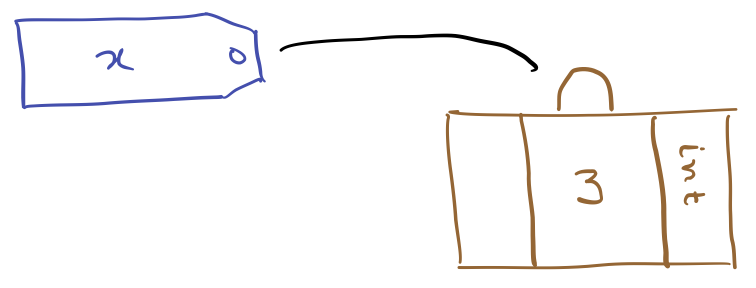
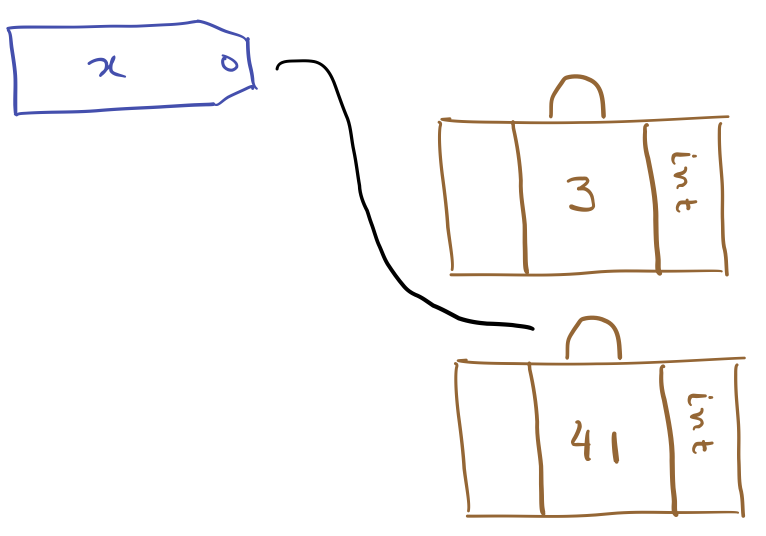
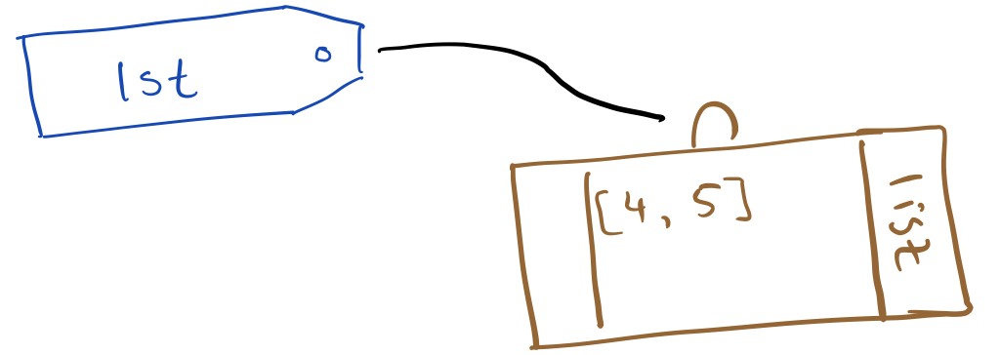
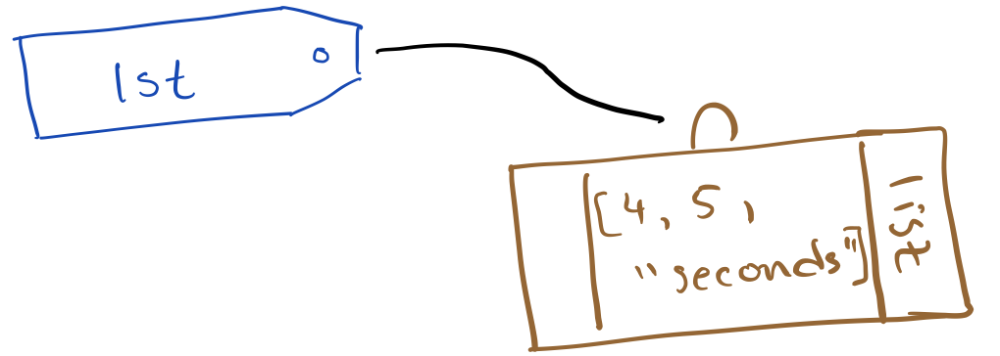
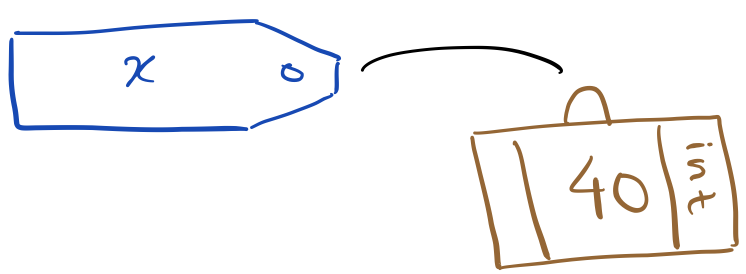
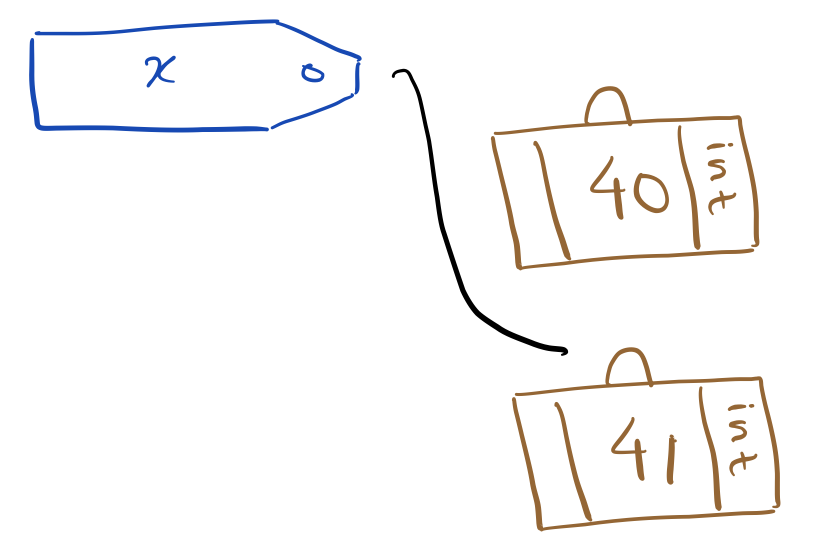
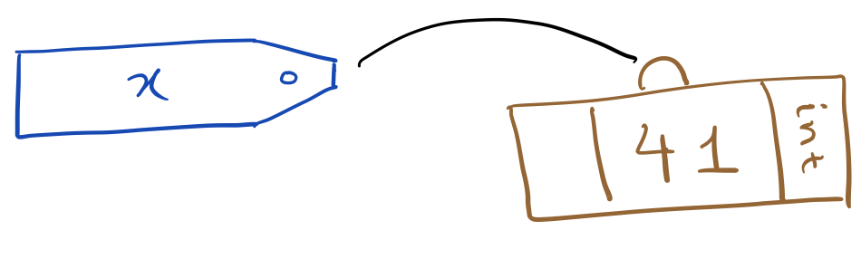
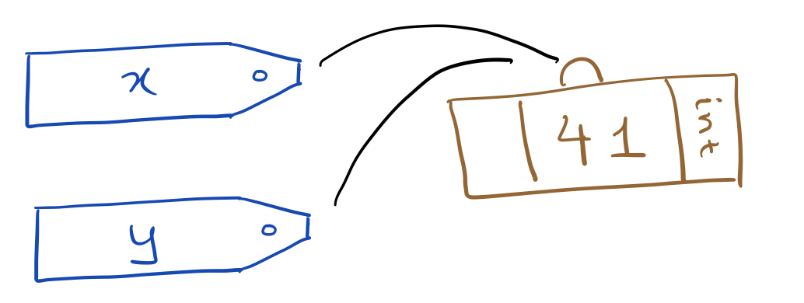
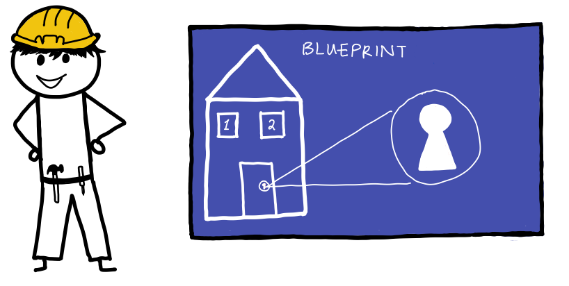
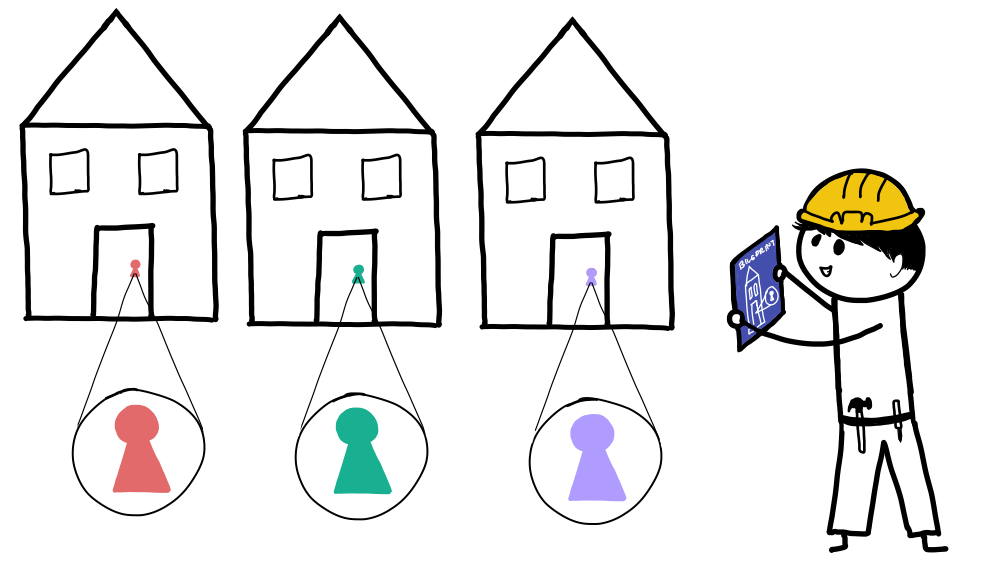

# Object Oriented Python
At this point, we've covered the basics of Python and, with this topic, we'll transition into doing more advanced programming in the language. That begins with a discussion of object-oriented programming in Python!

## Errors and Exceptions
Before we talk about object oriented programming, let's talk about the way that errors and exceptions work in Python. This topic might initially seem unrelated to object-oriented programming, but we'll revisit it towards the end and show how Python exceptions are an example of "object inheritance".

Imagine that you write some invalid Python code:

```python
int("Not an integer")
```

When you run the above code, Python will stop executing and raise a `ValueError`. It's possible to write programs that handle errors and exceptions instead of raising them to the user and causing the program to crash.

Python does this with `try` and `except` statements. For example,

```python
try:
    int("Not an integer")
except ValueError:
    print("That isn't a valid integer.")

# That isn't a valid integer.
```

When Python encounters a `try` statement, it will execute the code inside the try clause. If no exception occurs, Python will skip the `except` statements. If an exception does occur, Python will see if matches the exception named after the `except` keyword. If it does, Python will stop executing the try clause and execute the except clause – otherwise, the exception will be raised normally.

This can be useful when dealing with potentially invalid inputs. For example, imagine that we'd like to ask the user to enter an integer. The easiest way to check if they entered a valid integer is to try to convert it to an integer and catch the exception if it fails. For example,

```python
while True:
    try:
        age = int(input("How old are you? "))
        break
    except ValueError:
        print("That's not a valid age! Try again.")
```

If an invalid integer is entered, the `int` function will raise a `ValueError`, and Python won't execute the `break` statement, so it'll continue running the `while` loop. The loop will break only if the user enters a valid integer. After that, the `age` variable will contain an integer representing the user's age.

### Multiple `except` Statements
Sometimes, you might want to execute code that could raise different types of errors. For example, suppose that you're going to divide two numbers:

```python
numer = float(input("Numerator? "))
denom = float(input("Denominator? "))
print("{} / {} = {}".format(numer, denom, numer / denom))
```

This code could raise a `ValueError` if the user enters an invalid float, or it could raise a `ZeroDivisionError` if the denominator is zero. Fortunately, we can handle this with multiple `except` statements like this:

```python
while True:
    try:
        numer = float(input("Numerator? "))
        denom = float(input("Denominator? "))
        print("{} / {} = {}".format(numer, denom, numer / denom))
        break
    except ValueError:
        print("Please enter a valid float.")
    except ZeroDivisionError:
        print("The denominator can't be zero.")
```

You can also capture multiple exceptions with the following syntax:

```python
except (ValueError, ZeroDivisionError, NameError):
    ...
```

This can be useful when there are some errors that you'd like the program to handle but, if an unexpected error is raised, you'd like that error to propagate and cause the program to crash.

### Diagnosing Exceptions
Python exceptions can be printed to the command line with a descriptive message. To do this, use the `as` keyword to store the exception as a variable. Here's what that looks like:

```python
while True:
    try:
        age = int(input("How old are you? "))
        break
    except ValueError as e:
        print("That's not a valid age: {}".format(e))
```

Executing the code might look like (inputs are bolded and italicized):

<pre>
How old are you? <i><b>None of your business!</b></i>
That's not a valid age: invalid literal for int() with base 10: 'None of your business!'
How old are you? <i><b>20</b></i>
</pre>

This paradigm isn't frequently used unless you're debugging code or writing an application where the user is fairly tech-savvy, so it makes sense to reveal error text to them.

### Don't Catch 'em All!
In Python, you can catch all exceptions like so:

```python
try:
    ...
except:
    print("That didn't work!")
```

This is a dangerous paradigm, though, because Python implements several internal flags as exceptions. For example, you can normally press Control-C to quit a program. In Python, that raises a `KeyboardInterrupt`. However, a `KeyboardInterrupt` will be caught by the `except:` statement. Here's a (fairly artificial) example of how this could be bad:

```python
while True:
    try:
        numer = float(input("Numerator? "))
        print("{} / 0 = {}".format(numer, numer / 0))
        break
    except:
        print("That didn't work!")
```

In the above example, it's impossible to input a valid numerator, but pressing Control-C won't work either. For example, here's what a confused user might attempt to do with this code (inputs are bolded and italicized):

<pre>
Numerator? <i><b>10</b></i>
That didn't work!
Numerator? <i><b>Presses Control-C</b></i>
That didn't work!
Numerator? <i><b>Existential dread sets in...</b></i>
</pre>

### Raising Exceptions
You can raise your own exceptions with the `raise` keyword. Suppose you want to raise a `NameError`. That can be done with:

```python
raise NameError
```

You can also specify an error message by passing an argument to the name of the error. For example, if we raised:

```python
raise NameError("I don't like that name")
```

it would look like:

```
Traceback (most recent call last):
  File "<stdin>", line 1, in <module>
NameError: I don't like that name
```

### EAFP Versus LBYL
One peculiar piece of Python philosophy is that, because Python exceptions are very lightweight, it can be better to trigger an exception and catch it rather than checking to see if your action was valid in the first place.

For example, imagine that we have a dictionary that represents the number of chairs in a classroom:

```python
num_chairs = {"B02": 10, "Michael's bedroom": 2}
```

Imagine that we want to hide a $10 gift card under each chair in a classroom. The cost for a B02 is:

```python
b02_cost = num_chairs["B02"] * 10
```

It's possible that our key might not be in the dictionary and there are two ways to prevent this situation:

```python
if "Parth's bedroom" in num_chairs:
    cost = num_chairs["Parth's bedroom"] * 10
```

or:

```python
try:
    cost = num_chairs["Parth's bedroom"] * 10
except KeyError:
    pass
```

Note that the `pass` statement doesn't do anything.

There are a few reasons to prefer the second approach. For one, you only have to write the key (`"Parth's bedroom"`) once. It also reads differently: the second approach suggests that the key is expected to be in the dictionary while the first approach doesn't suggest whether the key is expected to be in the dictionary or not.

In Python, it's perfectly legitimate to use either. The first approach is often described as "looking before you leap" (LBYL) and the second is described by the phrase "it's easier to ask for forgiveness than permission" (EAFP). 

## The Data Model
One of the trickiest things to understand about Python is the way that Python stores data, internally. Understanding it will likely help you write more effective Python code and debug issues more easily. We know it's tricky, though, so we've included a summary in this section with the most important takeaways.

Everything in Python world is either an "object" or a "variable". As used, both of these terms have very precise technical meanings. Objects have identity, type, and value, and we'll dig into those below.

The best way to understand Python's data model is with an analogy: You can think of an object as a suitcase and a variable like a baggage tag that points to that suitcase.

So, when we write the following Python code,

```python
x = 3
```

we're really creating a suitcase that contains the number 3 and a luggage tag titled "x" and connecting the two:

<p align="center">
  <br />
  <i>Assigning <code>x</code> to 3.</i>
</p>

The image of the suitcase has the word `int` written on it to denote that the type of an object is a property that's stored on the suitcase, not the baggage tag. If we were to now assign,

```python
x = 41
```

this creates a new object and re-assigns the baggage tag `x`.

<p align="center">
  <br />
  <i>Reassigning <code>x</code> from 3 to 41.</i>
</p>

In particular, the value of the suitcase that contains the number 3 does not change. 

**Takeaway 1**: Assigning and reassigning variables (using the equals sign) moves the baggage tag between objects. It doesn't change the value of the objects themselves.

Integers are immutable, which means that once an `int` suitcase is created, its value will never change. Not all objects are like this! For example, `list` objects can change value after they are created. Objects whose values can change after they're created are called mutable.

You can tell that a new object isn't being created because updating the value of a mutable object doesn't use an assignment operator (e.g., to add to a list, you use `.append` which doesn't involve the equals sign as used for assignment). For example,

```python
lst = [4, 5]
lst.append("seconds")
```

<p align="center">
  <br />
  <i>Assigning <code>lst</code> to <code>[4, 5]</code>.</i>
</p>

<p align="center">
  <br />
  <i>Appending <code>"seconds"</code> to <code>lst</code>.</i>
</p>

At this point, you might be wondering what's happening when you change a variable that stores an immutable object, for example, when you increment an integer like so:

```python
x = 40
x += 1
```

When `x` is incremented, Python creates an entirely new object that stores the old value of `x` plus one:

<p align="center">
  <br />
  <i>Assigning <code>x</code> to 40.</i>
</p>

<p align="center">
  <br />
  <i>Incrementing <code>x</code> by one.</i>
</p>

**Takeaway 2**: Mutable objects can change value over their lifetime but immutable objects cannot. When you perform an operation on a variable that stores an immutable object and results in the variable changing value, you've created a new object not updated the value of the old object.

Finally, assigning a variable to another variable does not create a new object either. It just creates a new baggage tag that points to the existing object. For example,

```python
x = 41
y = x
```

<p align="center">
  <br />
  <i>Assigning <code>x</code> to 41.</i>
</p>

<p align="center">
  <br />
  <i>Assigning <code>y</code> to <code>x</code>.</i>
</p>

**Takeaway 3**: Setting one variable equal to another does not create a new object – it creates a new baggage tag pointing to the existing object.

Generally speaking, when you use the equals sign to assign a value, you're manipulating baggage tags and when you use object methods (with a period, like `variable.function`), you're manipulating the object.

Understanding the data model can help disentangle some potentially confusing code. For example, what do you think is printed out by the following code?

```python
x = 41
y = x
y += 1
print(x)
```

The answer is `41`. On the second line, `y` points to the same suitcase as `x`. Then, `y` is incremented. Since integers are immutable, a new object is created and `x` points to the original object. Then, the original object (41) is printed.

On the other hand, what about this code?

```python
x = [4, 5]
y = x
y.append("seconds")
print(x)
```

The answer is `[4, 5, "seconds"]`. Like before, `y` points to the same suitcase as `x`, but appending to a list changes the value of the suitcase; it doesn't move the baggage tag – there's only ever one object represented in the above code, and `"seconds"` is appended to it.

In Python, you can tell if two objects are the same using the `is` keyword. For example, consider `1` and `1.0`. The first object is an integer and the second object is a float. Since they have different types, they cannot be the same object. However, in Python, the two are equal:

```python
1 == 1.0 # => True
```

This is important! `==` checks equality. It does not check if two objects are the same. This allows us to compare objects of different types. To compare identity, you can use the `is` keyword:

```python
1 is 1.0 # => False
```

**Takeaway 4**: Use `==` when comparing value (almost always) and `is` when comparing identity (almost never).

### Takeaways

1. Assigning and reassigning variables (using the equals sign) moves the baggage tag between objects. It doesn't change the value of the objects themselves.
2. Mutable objects can change value over their lifetime but immutable objects cannot. When you perform an operation on a variable that stores an immutable object and results in the variable changing value, you've created a new object not updated the value of the old object.
3. Setting one variable equal to another does not create a new object – it creates a new baggage tag pointing to the existing object.
4. Use `==` when comparing value (almost always) and `is` when comparing identity (almost never).

## Classes

### An Analogy
Imagine that I, Parth, am going to start a residential construction company that builds houses. To do this successfully, I'm going to need to make a blueprint for a house. That blueprint should provide details about the structure of a house. For example, the blueprint might include details about the size of windows and the locking mechanism for the house.

<p align="center">
  <br />
  <i>My blueprint for a house. Illustration by the amazing Medha Sarin.</i>
</p>

Once I have a blueprint, I can use that blueprint to build multiple houses. Each of those houses will have the same structure, but will function independently – different houses will have different inhabitants. At any given time, one house might be locked while another is unlocked. One house might have open windows while the other has shut windows.

<p align="center">
  <br />
  <i>One blueprint can be used to build several houses. Illustration by the amazing Medha Sarin.</i>
</p>

In this analogy, the blueprint is analogous to a "class object" and the houses are analogous to "instance objects." In Python, we create classes that serve as blueprints for instances. The classes describe how the instances will function, but the instances are independent of one another.

### Syntax
You can declare a class with the `class` statement. Let's start by talking about class objects without worrying about the instance objects. Going back to our analogy, this is like having a blueprint, but not building any houses from it.

To declare a class, use the `class` keyword and give it a name:

```python
class MyClass:
    ...
```

You can write any Python code in place of the ellipses above! For example,

```python
class MyClass:
    favorite_num = 41

    def greet(name):
        print(f"Hiya, {name}! Lovely to meet you.")
```

All of the properties we just wrote down are stored as "attributes" of the class. An attribute of an object can be accessed by writing the name of the object, a period (`.`), and then the name of the attribute. For example,

```python
MyClass.favorite_num # => 41
MyClass.greet        # => <function MyClass.greet(name)>

MyClass.greet("Michael")

# Hiya, Michael! Lovely to meet you.
```

Now, let's use this blueprint to build a house. You can instantiate this class like so:

```python
my_object = MyClass()
```

`my_object` will be endowed with the properties from `MyClass`. For example,

```python
my_object.favorite_num # => 41
```

### Custom Instantiation
We just saw how to instantiate `MyClass` by writing `MyClass()`. You might observe that this kind of looks like we're calling a function called `MyClass`. In fact, this isn't far from the truth!

When you instantiate a class, it calls a function called `__init__`. Additionally, you can overwrite the `__init__` function to customize the instantiation process. Continuing with our analogy, imagine if we made a blueprint but, before we built any houses, we required the clients to specify the color of the house. In that example, we have a blueprint that will be used to build the house and it needs some additional input before the house can be constructed.

We might write such a class like this:

```python
class House:
    num_windows = 8
    
    def __init__(self, color='purple'):
        self.color = color
```

Then, when this class is initiated, the `__init__` method is called with the arguments provided between the parentheses after `House`:

```python
michael = House('elephant grey')
michael.num_windows # => 8
michael.color       # => 'elephant grey'

parth = House()
parth.num_windows   # => 8
parth.color         # => 'purple'
```

### Instance Objects
Let's dig into these instance objects a bit more. We just saw how you can access the attributes of an instance like so:

```python
parth.color # => 'purple'
```

You can also reassign the attributes of an instance like so:

```python
parth.color = 'pink'
```

Be careful with this! In Python, all attributes can be modified by the user, so nothing is truly private (here, "private" is meant in the sense of Java or C++). By convention, if an attribute is supposed to be private, we preface it with an underscore (e.g., `_basement`). To make an attribute super private, we can preface it with two underscores (e.g., `__electricity_access`) and the interpreter will change the name. For example,

```python
class SecretKeeper:
    _answer = 42
    __super_secret_answer = 41

s = SecretKeeper()

s._answer                            # => 42
s.__super_secret_answer              # AttributeError
s._SecretKeeper__super_secret_answer # => 41
```

> Adding two underscores "mangles" the name by adding the name of the class before the name of the attribute, but it won't obfuscate it any further.

### Methods vs. Functions
We swept something under the rug earlier that we're going to tease apart now. Earlier, we saw how to create a custom constructor in the `House` object like so:

```python
class House:
    num_windows = 8
    
    def __init__(self, color='purple'):
        self.color = color
```

The `__init__` function asks for this variable called `self` but when we instantiated the class, we only ever specified the color! What's going on?

It turns out that when a class is instantiated, its functions are bound as "methods." For example,

```python
class SayHello:
    def greet(self):
        return 'Hello!'

x = SayHello()

x.greet        # => <bound method SayHello.greet of ...>
SayHello.greet # => <function SayHello.greet(self)>

x.greet is SayHello.greet # => False
```

The method on the object (`x.greet`) is not the same as the function on the class (`SayHello.greet`). In fact, methods function like so:

```
object.function(arguments) = function(object, arguments)
```

In our example, calling `x.greet()` really calls `SayHello.greet(x)` under the hood.

`self` is an incredibly powerful nuance because it allows different instances to function independently. In the analogy, we described that the blueprint could describe how locks work, but different houses will have different locks. Here's a programmatic expression of this idea:

```python
class LockableHouse:
    def __init__(self):
        self.locked = True
    
    def unlock(self):
        self.locked = False
    
    def lock(self):
        self.locked = True
```

Now, we can see how different instances function differently:

```python
parth = LockableHouse()
michael = LockableHouse()

parth.locked   # => True
michael.locked # => True

michael.unlock()

parth.locked   # => True
michael.locked # => False
```

### Shared Resources
Attributes that are declared on the class are shared among all of the instances. This is usually fine when those attributes are immutable (like `num_windows` above) because if an instance tries to update them, it'll create a new object for that instance and change that instance's baggage tag, leaving the class attribute unchanged.

That's not true when the attribute is mutable, however. For example, let's define the following class:

```python
class Puppy:
    tricks = []

    def __init__(self, name):
       self.name = name
    
    def learn_trick(self, trick):
       self.tricks.append(trick)
```

Note that when the code references `self.tricks`, it actually resolves to the `tricks` variable declared in the first line of the class definition.

What happens when we create multiple puppies and teach one of them a trick? Let's see:

```python
buddy = Puppy('Buddy')
astro = Puppy('Astro')

buddy.learn_trick('roll over')

buddy.tricks # => ['roll over']
astro.tricks # => ['roll over']
Puppy.tricks # => ['roll over']
```

Uh oh! That behavior is probably not what we wanted. It's happening because `tricks` is declared at the class level, so all instances share a reference to one `tricks` object.

Let's see what happens if we try to declare `tricks` as an attribute of `self` instead of the class. That is, let's define:

```python
class Puppy:
    def __init__(self, name):
       self.name = name
       self.tricks = []
    
    def learn_trick(self, trick):
       self.tricks.append(trick)
```

And, let's execute:

```python
buddy = Puppy('Buddy')
astro = Puppy('Astro')

buddy.learn_trick('roll over')

buddy.tricks # => ['roll over']
astro.tricks # => []
```

Much better! Each time the `__init__` function is executed, Python creates a new object that is stored in the `tricks` attribute.

### Magic Methods
One of the most powerful features of Python is that you can design classes that hook into built-in Python operations like addition. That is, you can define what it means to add two instances of a class.

This is done using the `__add__` function. Let's see it in action by creating a class that represents a point in a 2D plane:

```python
class Point:
    def __init__(self, x, y):
       self.x = x
       self.y = y
    
    def __add__(self, other):
        return Point(self.x + other.x, self.y + other.y)
```

Before we unpack what's going on, let's see this in action:

```python
p1 = Point(3, 5)
p2 = Point(9, 10)

result = p1 + p2

result.x, result.y # => (12, 15)
type(result)       # => Point
```

Wow, pretty neat! We added two `Point` objects together and got another `Point` as the result. The resulting value also had the appropriate `x` and `y` coordinates.

So, how is this happening? When you add two things together in Python, it actually calls the `__add__` function under the hood. Writing `p1 + p2`, is equivalent to calling `p1.__add__(p2)`. The way we wrote that function, `p1` is `self` and `p2` is `other`. Then, that function returns a new `Point` object whose `x` coordinate is the sum of `self.x` (3) and `other.x` (9) and does the same for `y`.

Python uses a ton of magic methods in everything we've seen so far. Here are some examples from most commonly used at the top to least commonly used at the bottom:

```python
str(x)  # => x.__str__() 

x == y  # => x.__eq__(y)
x < y   # => x.__lt__(y)
x + y   # => x.__add__(y)

len(x)  # => x.__len__()
el in x # => x.__contains__(el)

iter(x) # => x.__iter__()
next(x) # => x.__next__()
```

You'll notice that each of these methods starts and ends with two underscores. These are also called "dunder" methods — Python frequently uses methods that are named like this for interacting with built-in operations.

You can implement any of these methods yourself, in your own classes! For example, our current `Point` class doesn't have an `__str__` method, so trying to print a `Point` can be kind of gross:

```python
print(p1)

# <Point object at 0x10a103d0>
```

The hex at the end is the memory address of `p1`. We can make this cleaner by adding an `__str__` method:

```python
class Point:
    def __init__(self, x, y):
       self.x = x
       self.y = y
    
    def __add__(self, other):
        return Point(self.x + other.x, self.y + other.y)
    
    def __str__(self):
       return f"Point({self.x}, {self.y})"
```

Now, when we try to print a `Point`, it looks like this:

```python
p1 = Point(3, 5)
print(p1)

# Point(3, 5)
```

Gorgeous!

### Inheritance
Finally, classes can "inherit" from one another. This means that a child class will be able to access attributes of its parent class. You specify inheritance by writing the name of the parent class in parentheses:

```python
class EnglishSpeaker:
    greeting = "Hello!"

class American(EnglishSpeaker):
    pass
```

Now, you can access `greeting` as an attribute of `American`:

```python
American.greeting # => 'Hello!'
```

Just like before, these properties also transfer to instances of the child classes:

```python
parth = American()
parth.greeting # => 'Hello!'
```

Additionally, children can override values from their parents:

```python
class EnglishSpeaker:
    greeting = "Hello!"

class Canadian(EnglishSpeaker):
    greeting = "Sooory!"

EnglishSpeaker.greeting # => 'Hello!'
Canadian.greeting       # => 'Sooory!'
```

Let's dig into what's going on a bit more. When you reference an attribute on a child class, Python will search upwards through the chain of inheritance and stop once it finds a definition for the value. When `Canadian` overrides the value of `greeting`, a reference to `Canadian.greeting` stops at the `Canadian` level and Python never checks `EnglishSpeaker`.

## Exceptions as Classes
It turns out that every exception is actually a class! These classes inherit from each other in the structure described below:

```
BaseException
 ├── SystemExit
 ├── KeyboardInterrupt
 ├── GeneratorExit
 └── Exception
      ├── StopIteration
      ├── StopAsyncIteration
      ├── ArithmeticError
      │    ├── FloatingPointError
      │    ├── OverflowError
      │    └── ZeroDivisionError
      ├── AssertionError
      ├── AttributeError
      ├── BufferError
      ├── EOFError
      ├── ImportError
      │    └── ModuleNotFoundError
      ├── LookupError
      │    ├── IndexError
      │    └── KeyError
      ├── MemoryError
      ├── NameError
      │    └── UnboundLocalError
      ├── OSError
      │    ├── BlockingIOError
      │    ├── ChildProcessError
      │    ├── ConnectionError
      │    │    ├── BrokenPipeError
      │    │    ├── ConnectionAbortedError
      │    │    ├── ConnectionRefusedError
      │    │    └── ConnectionResetError
      │    ├── FileExistsError
      │    ├── FileNotFoundError
      │    ├── InterruptedError
      │    ├── IsADirectoryError
      │    ├── NotADirectoryError
      │    ├── PermissionError
      │    ├── ProcessLookupError
      │    └── TimeoutError
      ├── ReferenceError
      ├── RuntimeError
      │    ├── NotImplementedError
      │    └── RecursionError
      ├── SyntaxError
      │    └── IndentationError
      │         └── TabError
      ├── SystemError
      ├── TypeError
      ├── ValueError
      │    └── UnicodeError
      │         ├── UnicodeDecodeError
      │         ├── UnicodeEncodeError
      │         └── UnicodeTranslateError
      └── Warning
           ├── DeprecationWarning
           ├── PendingDeprecationWarning
           ├── RuntimeWarning
           ├── SyntaxWarning
           ├── UserWarning
           ├── FutureWarning
           ├── ImportWarning
           ├── UnicodeWarning
           ├── BytesWarning
           └── ResourceWarning
```

Wow! In practice, it's really good style to create and raise your own, custom exceptions. You can do that using inheritance. Let's say you're making an app where users can log in. You might want to create an error for the situation where the user entered incorrect credentials that's raised during runtime. Here's how you might define that in your module:

```python
class BadLoginError(RuntimeError):
    """
    A user attempted to log in with invalid credentials.
    """
```

Then, when you need to raise that error, you can just:

```python
raise BadLoginError("Username: parth, Password: I <3 unicorns")
```

> With love, 🦄s, and 🐘s by the CS41 Staff