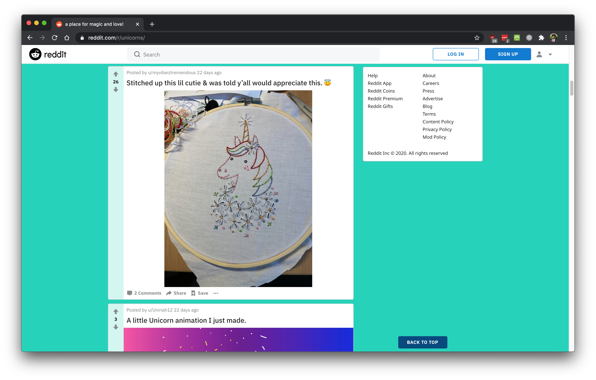
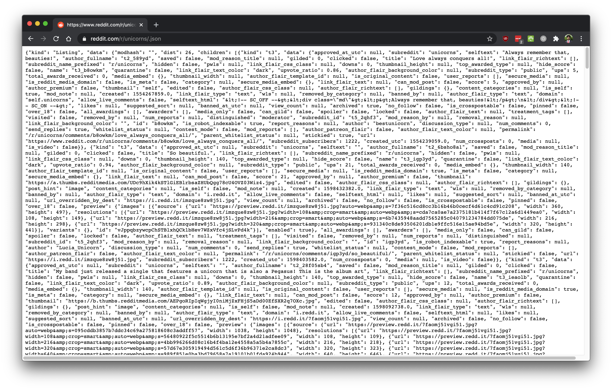
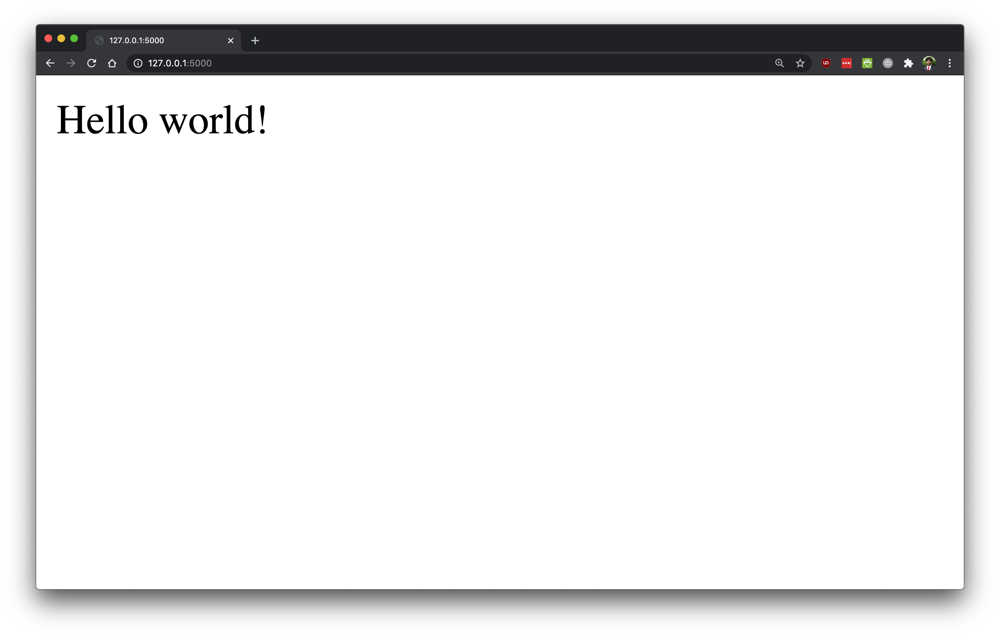
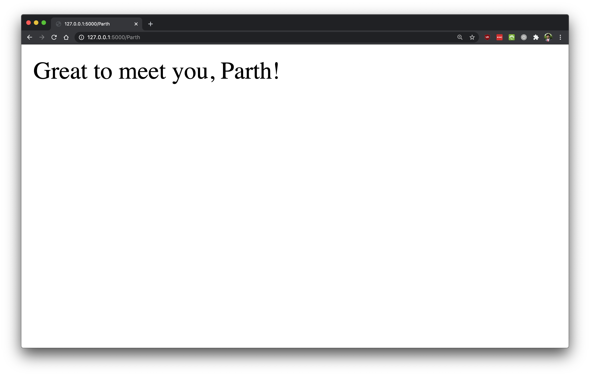
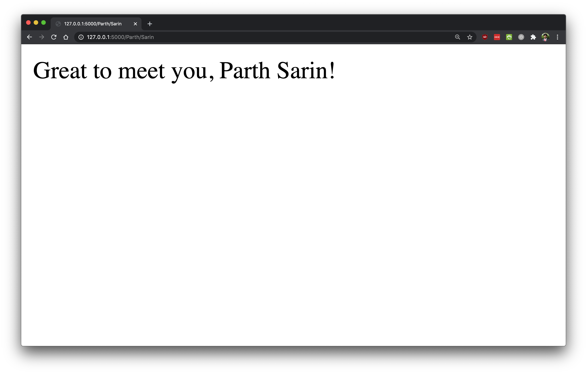
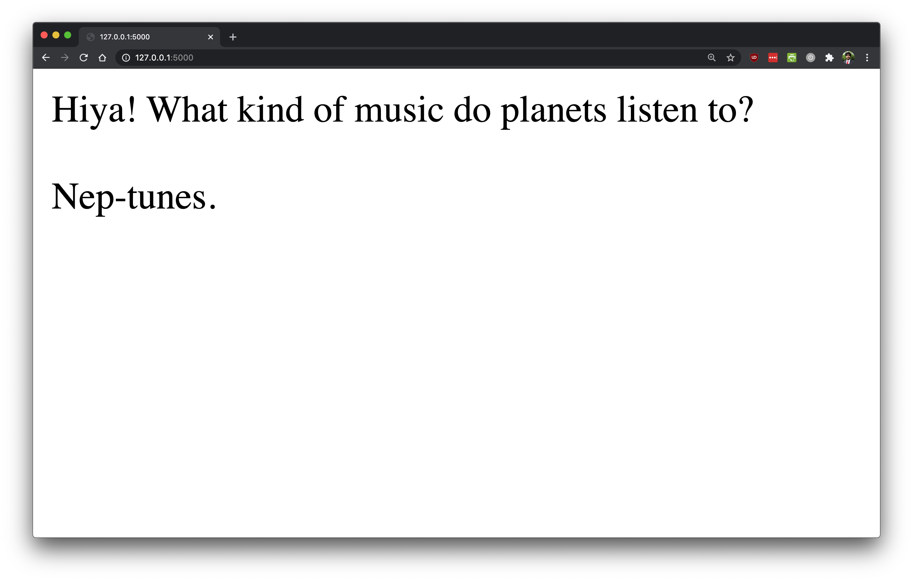
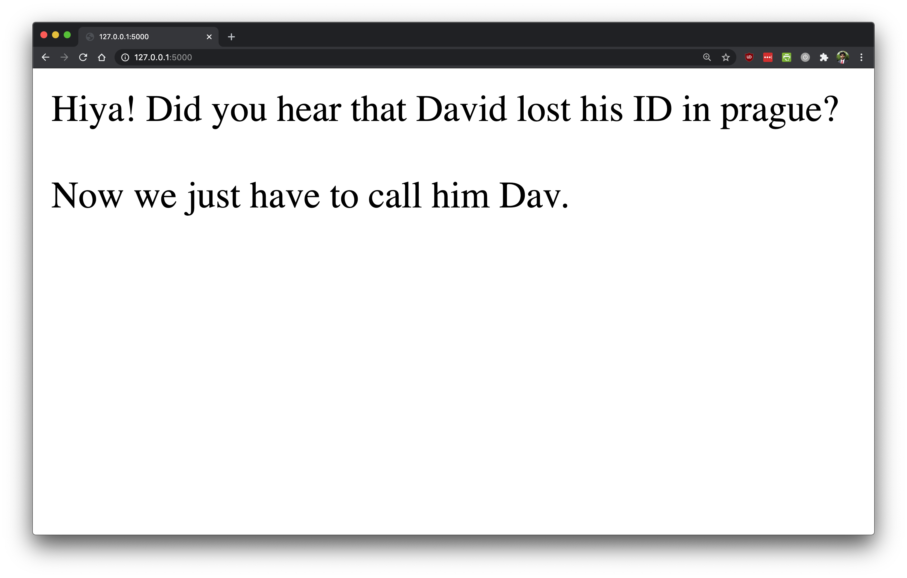
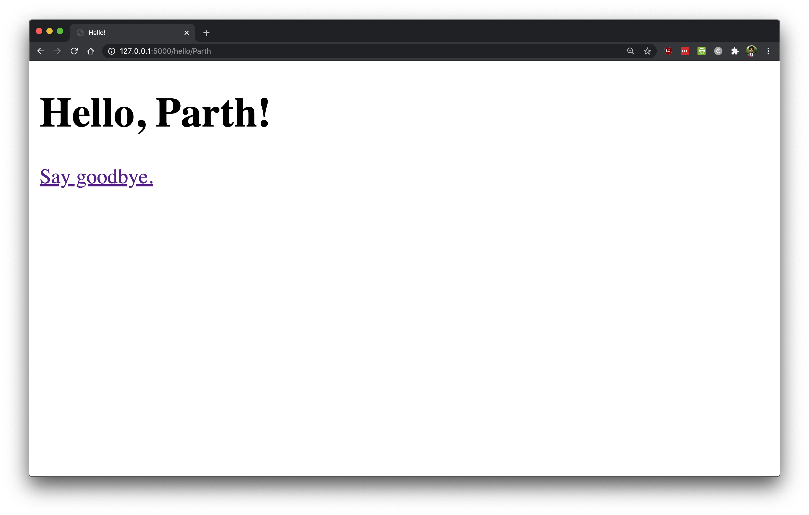

# Python and the Web
Python can interact with the web in ways that really illuminate the applications of what we've been studying so far. In this section of the notes, we'll learn how to visit websites in Python and also how to serve a Python website to the rest of the world using `flask`.

## Querying Websites
Python can browse the web using a library called `requests`, which allows you to make web requests. To install this library, run the following command at a command prompt within your virtual environment (not including the dollar sign):

```
$ python -m pip install requests
```

Then, we can import the `requests` library into a Python environment like you'd import any other package:

```python
import requests
```

Let's make our first web request! For example, let's query `http://www.magicalunicornsociety.co.uk/`:

```python
requests.get("http://www.magicalunicornsociety.co.uk/") # => <Response 200>
```

This query returns a `Response` object! There's actually a Python class that the `requests` library is using to represent a website's response. For example, here's what happens if we query a webpage that doesn't exist:

```python
requests.get("http://www.magicalunicornsociety.co.uk/unicorns-with-wings") # => <Response [404]>
```

That's right! We get a 404 response, just like if we were browsing the web and entered a URL that doesn't exist. Let's investigate this response object a bit more. If we save it as a variable, we can take a look at some of its properties:

```python
r = requests.get("http://www.magicalunicornsociety.co.uk/")
```

Then, we can investigate some of its properties. We can access the status code of a response (200, 404, etc.) like this:

```python
r.status_code # => 200
```

Usually, though, we're not interested in the status code as much as whether the request succeeded or failed. We can access that as `r.ok`:

```python
r.ok # => True
```

Because the request worked, we know that the response probably contains meaningful information, which we can see with `r.content`:

```python
print(r.content)

# <!DOCTYPE html>
# <html lang="en-US" prefix="og: http://ogp.me/ns#">
# 	<head>
# 		<meta charset="UTF-8">
# 		<meta name="viewport" content="width=device-width, initial-scale=1">
# 		<link rel="profile" href="http://gmpg.org/xfn/11">
# 		<link rel="pingback" href="http://www.magicalunicornsociety.co.uk/xmlrpc.php">
# 		<title>The Magical Unicorn Society - The Facts, Myths and Legends of Unicorns</title>
# ...
```

What interesting gibberish! There's some recognizable information towards the end: it looks like the title of this website is "The Magical Unicorn Society - The Facts, Myths and Legends of Unicorns" but it's not clear what much of this information is...

This is actually a different programming language called HTML. To see this, we can look at the headers of the response:

```python
r.headers['Content-Type'] # => 'text/html; charset=UTF-8'
```

Most of the internet is written in HTML! Because it's so popular, you can download Python packages that allow you to work with HTML code in Python, but we're not going to do that right now.

Instead, we're going to focus on websites that respond with a different type of content: JSON. JSON stands for JavaScript Object Notation. It's a way of encoding information that's more amenable to Python.

For example, let's brows to `https://official-joke-api.appspot.com/random_joke`, which will tell you a random joke:

```python
r = requests.get('https://official-joke-api.appspot.com/random_joke')

r.ok                      # => True
r.headers['Content-Type'] # => 'application/json; charset=utf-8'
```

As you can see, this website responds with JSON code, and if we look at the content, it'll be a bit more readable:

```python
r.content # => b'{"id":273,"type":"general","setup":"What musical instrument is found in the bathroom?","punchline":"A tuba toothpaste."}'
``` 

If you're following along, your joke will likely be different, but it'll be formatted the same way with a `"setup"` and a `"punchline"`.

You might notice that this code looks like Python! In fact, you can convert JSON code to Python code using the `.json` method on a response object:

```python
py_joke = r.json() # => {'id': 273, 'type': 'general', 'setup': 'What musical instrument is found in the bathroom?', 'punchline': 'A tuba toothpaste.'}

type(py_joke) # => dict
```

Fascinating! The JSON object, when converted into a Python object, is a dictionary. Then, we can work with this dictionary just like any other Python object. For example,

```python
print(py_joke['setup'], end=" ")
ans = input()

if ans == py_joke['punchline']:
    print("Yup! Funny joke, huh?")
else:
    print("Nope! {}".format(py_joke['punchline']))
```

Here's what this might look like, when run (user input bolded and italicized):

<pre>
What musical instrument is found in the bathroom? <b><i>A urin-music-al?</i></b>
Nope! A tuba toothpaste.
</pre>

Pro tip: many websites can be converted to JSON format if you add `.json` to the end of your URL. For example:

<p align="center">
  <br />
  <i>Visiting <a href="https://www.reddit.com/r/unicorns/">https://www.reddit.com/r/unicorns/</a> in a web browser.</i>
</p>

<p align="center">
  <br />
  <i>Visiting <a href="https://www.reddit.com/r/unicorns/.json">https://www.reddit.com/r/unicorns/.json</a> in a web browser.</i>
</p>

Even though the lower webpage might look less visually appealing, it contains all of the same information and Python can process it more easily. Chances are, for most cases where you'd like to browse the web in Python, you can do it with JSON code!

> If you're working with a website that doesn't have a JSON endpoint, consider using libraries like [requests-html](https://requests.readthedocs.io/projects/requests-html/en/latest/) or [BeautifulSoup](https://www.crummy.com/software/BeautifulSoup/bs4/doc/).

## Building Websites
Python can do more than just browse the web: it can power the web! Websites like Instagram, Spotify, Google, and Netflix all use Python in their backend. This is really useful because most web programming languages aren't as powerful as Python. Connecting Python to the web allows you to use any Python code (including 3rd party libraries) to interact with users.

The Python library `flask` is designed to serve websites. To install this library, run the following command at a command prompt within your virtual environment (not including the dollar sign):

```
$ python -m pip install flask
```

### Hello World!
Let's make our first Python website in a file called `app.py`!

```python
"""
File: app.py
------------

A simple flask app!
"""
from flask import Flask

app = Flask(__name__)

@app.route("/")
def main():
    return 'Hello world!'
```

There's a lot going on here, so let's break it down, piece by piece.

1. First we import an object called `Flask` from the `flask` library.
2. Then, we call `Flask(__name__)` and store the result as `app`. This creates a Flask object that we're going to use to construct the website. Passing `__name__` just tells Flask the location of the `app.py` file.
3. Then, we decorate a function called `main`. `main` just returns `'Hello world!'` and the decorator is `@app.route("/")`. This is a way of telling the app that whenever a user accesses the route `/`, Flask should call this function.

Let's start the Flask server! At a terminal, in the same directory as `app.py`, run:

```
$ export FLASK_APP=app.py
$ flask run
```

The first line tells Flask to start `app.py` and the second line actually starts Flask. You should see some output that looks like:

```
 * Serving Flask app "app.py"
 * Environment: production
   WARNING: This is a development server. Do not use it in a production deployment.
   Use a production WSGI server instead.
 * Debug mode: off
 * Running on http://127.0.0.1:5000/ (Press CTRL+C to quit)
```

Now, our web server is running. Let's navigate there in the browser and see what we get!

<p align="center">
  <br />
  <i>Visiting <a href="http://127.0.0.1:5000/">http://127.0.0.1:5000/</a> in a web browser.</i>
</p>

### Routing
We can use Flask to host websites at sub-routes like `/bye`. For example, we can add another function to `app.py` that handles the `/bye` route:

```python
"""
File: app.py
------------

A simple flask app!
"""
from flask import Flask

app = Flask(__name__)

@app.route("/")
def main():
    return 'Hello world!'

@app.route("/bye")
def goodbye():
    return 'Bye! Thanks for visiting!'
```

Now, let's re-start our Flask server:

```
$ flask run
 * Serving Flask app "app.py"
 * Environment: production
   WARNING: This is a development server. Do not use it in a production deployment.
   Use a production WSGI server instead.
 * Debug mode: off
 * Running on http://127.0.0.1:5000/ (Press CTRL+C to quit)
```

And, let's navigate to the sub-route:

<p align="center">
  <br />
  <i>Visiting <a href="http://127.0.0.1:5000/bye">http://127.0.0.1:5000/bye</a> in a web browser.</i>
</p>

We can also add variables within our routes and Flask will pass them to the function. For example, we can make a route that accepts a `name` variable:

```python
"""
File: app.py
------------

A simple flask app!
"""
from flask import Flask

app = Flask(__name__)

@app.route("/")
def main():
    return 'Hello world!'

@app.route("/<name>")
def greet(name):
    return f'Great to meet you, {name}!'
```

Then, whatever word we put after the `/` in the url will be passed to the `greet` function as the parameter `name`. For example,

<p align="center">
  <br />
  <i>Visiting <a href="http://127.0.0.1:5000/Parth">http://127.0.0.1:5000/Parth</a> in a web browser.</i>
</p>

And, we can even stack the routes. For example, this function accepts a first and last name:

```python
"""
File: app.py
------------

A simple flask app!
"""
...
@app.route("/<first_name>/<last_name>")
def greet(first_name, last_name):
    return f'Great to meet you, {first_name} {last_name}!'
```

We can access this by adding the first and last name after the base URL, with a slash in between:

<p align="center">
  <br />
  <i>Visiting <a href="http://127.0.0.1:5000/Parth/Sarin">http://127.0.0.1:5000/Parth/Sarin</a> in a web browser.</i>
</p>

### More Complex Python Operations
When a user requests a webpage, we can perform more complicated Python operations. For example, we can even query another website! Let's build a website that tells a joke whenever we visit it:

```python
"""
File: app.py
------------

A website that tells jokes (using the Official Joke API).
"""
from flask import Flask
import requests

app = Flask(__name__)

@app.route("/")
def main():
    r = requests.get('https://official-joke-api.appspot.com/random_joke')

    if r.ok:
        r = r.json()
        return f"Hiya! {r['setup']}<br /><br />{r['punchline']}"
    else:
        return "Wanna hear something funny? Me too..."
```

Note that the `<br />` string inserts a newline into the website (it stands for "break"). Now, when we visit website, it looks like this:

<p align="center">
  <br />
  <i>Visiting <a href="http://127.0.0.1:5000/">http://127.0.0.1:5000/</a> in a web browser.</i>
</p>

And, if we reload the page, it'll tell us a different joke!

<p align="center">
  <br />
  <i>Visiting <a href="http://127.0.0.1:5000/">http://127.0.0.1:5000/</a> in a web browser.</i>
</p>

Of course, you can perform more complicated operations: you can run any Python code! You could query a database, build or run a machine learning model, etc. The possibilities are limitless!

### Templates
If you're comfortable with HTML, know that you can use Flask with HTML to make prettier websites. Flask supports templating using [Jinja2](https://jinja.palletsprojects.com/en/2.11.x/), which allows you to write HTML code and inject values from Python!

To use templates, make a folder called `templates` in your root directory and add a template inside of it with the extension `.html`. Altogether, the directory structure will look like:

```
.
├── app.py
└── templates/
    └── hello.html
```

Suppose that we'd like to render `hello.html` when the user visits `/hello/<name>`. We can do that with the following Python code:

```python
"""
File: app.py
------------

A simple flask app with templating!
"""
from flask import Flask, render_template

app = Flask(__name__)

@app.route("/hello/<name>")
def greet(name):
    return render_template("hello.html", name=name)

@app.route("/bye")
def goodbye():
    return 'Bye! Thanks for visiting!'
```

Notice that we pass the variable `name=name` into the `render_template` function. This will provide `name` to the template. We can use that value inside the template like so:

```jinja
<!DOCTYPE html>
<html lang="en">
<head>
    <meta charset="UTF-8">
    <meta name="viewport" content="width=device-width, initial-scale=1.0">
    <title>Hello!</title>
</head>
<body>
    <h1>Hello, {{ name }}!</h1>
    <a href="/bye">Say goodbye.</a>
</body>
</html>
```

Then, if we visit the relevant URL:

<p align="center">
  <br />
  <i>Visiting <a href="http://127.0.0.1:5000/hello/Parth">http://127.0.0.1:5000/hello/Parth</a> in a web browser.</i>
</p>

The `Say goodbye.` text is a valid link and if we click it, it takes us to the following page:

<p align="center">
  <br />
  <i>Visiting <a href="http://127.0.0.1:5000/bye">http://127.0.0.1:5000/bye</a> in a web browser.</i>
</p>

You can perform more complicated operations in Jinja that include using `if` statements, handling lists, and more. Read about Jinja here: <https://jinja.palletsprojects.com/>.

> With love, 🦄s, and 🐘s by the CS41 Staff